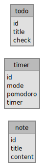

# Vanchor

**Just to train me**


Dashboard with my personal tools:

- timer, pomodoro, stopwatch
- todo
- notes
- algo code library (Vanchor)
- Kanban

### Bug / to do

 - [ ] timer bug stopwatch
 - [ ] drag & drop todo
 - [ ] Kanban
 - [ ] init database
 - [ ] unit test
 - [ ] Vanchor
 - [ ] Dashboard (currently empty)

## Client

`npm run serve`

## Server

`nodemon server.js`

## Database

### Docker

```bash
docker network create mongo-express
docker run --name mongo-db -d --network mongo-express -p 27017:27017 mongo
docker run -it -d --rm --network mongo-express --name mongo-express --link mongo-db:mongo -p 8082:8081 mongo-express
```

### MCD


